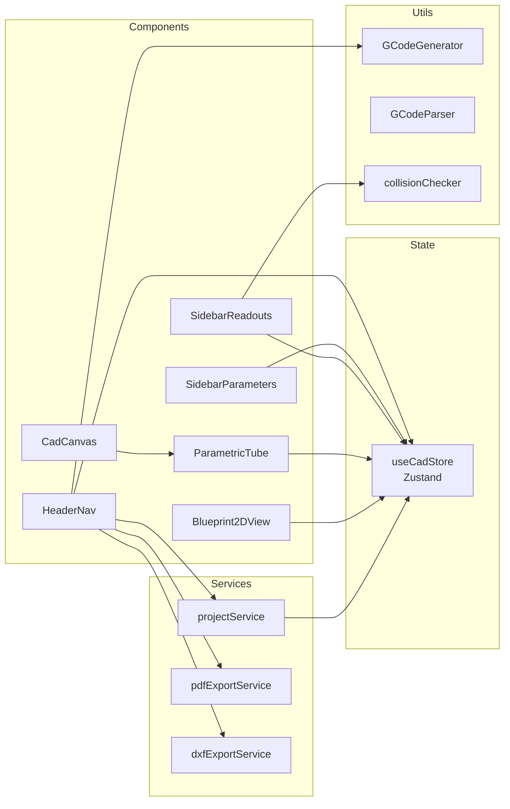
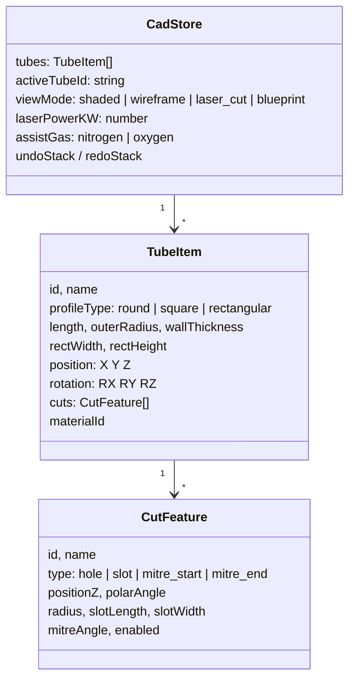
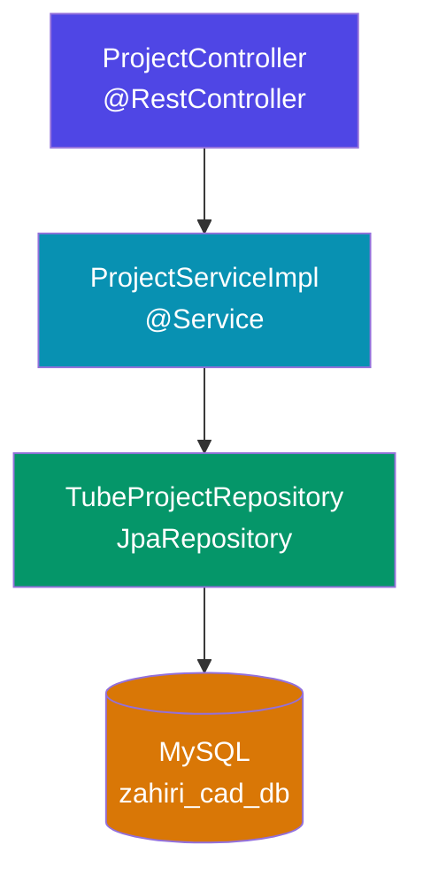
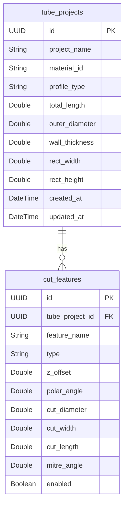
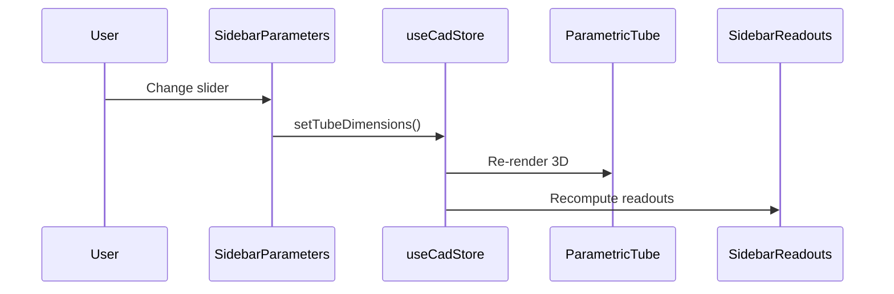
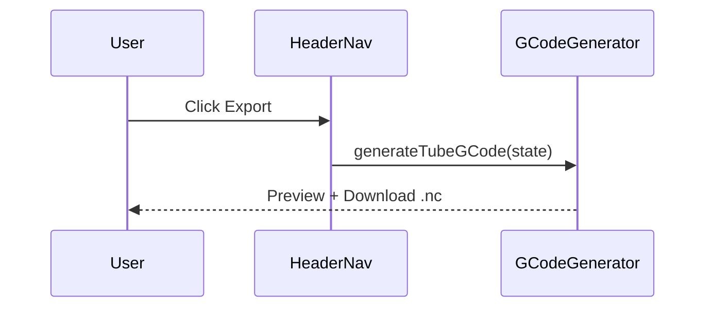
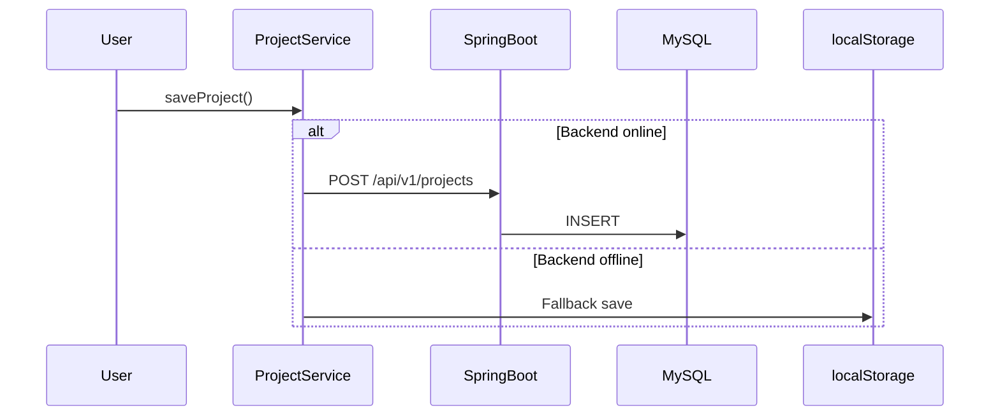

# 🏗️ Zahiri Metal CAD — Architecture

---

## Overview

A browser-based 3D parametric CAD for designing laser-cut metal tubes and exporting CNC-ready files.

```
 User (Browser)          Spring Boot API           MySQL 8
┌──────────────┐        ┌──────────────┐        ┌──────────┐
│  React 18    │  HTTP   │  Java 17+    │  JDBC   │ zahiri_  │
│  Three.js    │◄──────►│  Port 8080   │◄──────►│ cad_db   │
│  Port 5173   │  JSON   │              │        │          │
└──────────────┘        └──────────────┘        └──────────┘
```

---

## Tech Stack

| Layer | Technologies |
|---|---|
| **Frontend** | React 18 · TypeScript · Vite · Three.js · R3F · CSG · Zustand · Tailwind 4 · Axios · Framer Motion · jsPDF · i18next |
| **Backend** | Java 17 · Spring Boot 3.3 · Spring Data JPA · Hibernate · Lombok · Maven |
| **Database** | MySQL 8 (XAMPP) · HikariCP |
| **Deploy** | Vercel (frontend only) |

---

## File Tree

```
📦 3D-CAD-LASER-CUTTING/
│
├── 🖥️ frontend/
│   ├── src/
│   │   ├── App.tsx                    # Root layout
│   │   ├── main.tsx                   # Entry point
│   │   │
│   │   ├── components/
│   │   │   ├── HeaderNav.tsx          # Top bar — menus, export, undo/redo
│   │   │   ├── SidebarParameters.tsx  # Left — dimensions, materials, tubes
│   │   │   ├── SidebarReadouts.tsx    # Right — weight, volume, alerts
│   │   │   ├── CutFeatureManager.tsx  # Cut CRUD list
│   │   │   ├── GCodeExportModal.tsx   # G-Code preview & download
│   │   │   ├── ProjectLoadModal.tsx   # Save/Load/Import modal
│   │   │   ├── StatusBar.tsx          # Bottom info bar
│   │   │   └── canvas/
│   │   │       ├── CadCanvas.tsx      # 3D viewport wrapper
│   │   │       ├── ParametricTube.tsx # Tube mesh + CSG cuts
│   │   │       ├── LaserCutEffect.tsx # Laser beam animation
│   │   │       └── Blueprint2DView.tsx# 2D unrolled sheet SVG
│   │   │
│   │   ├── store/
│   │   │   └── useCadStore.ts         # Zustand — all app state
│   │   │
│   │   ├── services/
│   │   │   ├── apiClient.ts           # Axios config
│   │   │   ├── projectService.ts      # Save/Load API calls
│   │   │   ├── pdfExportService.ts    # PDF generation
│   │   │   └── dxfExportService.ts    # DXF 2D export
│   │   │
│   │   ├── utils/
│   │   │   ├── GCodeGenerator.ts      # CAD state → G-Code
│   │   │   ├── GCodeParser.ts         # G-Code file → CAD state
│   │   │   └── collisionChecker.ts    # Feasibility validation
│   │   │
│   │   ├── i18n/config.ts             # EN / FR setup
│   │   └── locales/{en,fr}/           # Translations
│   │
│   ├── package.json
│   └── vite.config.ts
│
├── ⚙️ backend/
│   └── src/main/java/com/zahirimetal/cad/
│       ├── ZahiriMetalCadBackendApplication.java
│       ├── config/CorsConfig.java
│       ├── controller/ProjectController.java
│       ├── dto/{TubeProjectDto, CutFeatureDto}.java
│       ├── entity/{TubeProject, CutFeature}.java
│       ├── repository/{TubeProject, CutFeature}Repository.java
│       └── service/ProjectService.java
│           └── impl/ProjectServiceImpl.java
│
├── vercel.json
└── README.md
```

---

## UI Layout

```
┌──────────────────────────────────────────────────────────┐
│                     HeaderNav                            │
│  [New] [Save] [Load] [Import]   [G-Code] [DXF] [PDF]    │
│  [Shaded|Wire|Laser|Blueprint]  [Undo] [Redo] [EN|FR]   │
├──────────┬───────────────────────────────┬───────────────┤
│          │                               │               │
│ Sidebar  │        CadCanvas              │   Sidebar     │
│ Params   │     3D Three.js View          │   Readouts    │
│          │          OR                   │               │
│ • Profile│     Blueprint2DView           │ • Weight (kg) │
│ • Dims   │     2D SVG Unroll             │ • Volume      │
│ • Cuts   │                               │ • Area        │
│ • Material                               │ • Cycle Time  │
│ • Laser  │                               │ • ⚠ Alerts    │
│ • Tubes  │                               │               │
├──────────┴───────────────────────────────┴───────────────┤
│                     StatusBar                            │
└──────────────────────────────────────────────────────────┘
```

---

## Frontend Architecture



---

## State Model (Zustand)



**5 Materials**: Steel 304 · Steel S235 · Aluminum 6061 · Titanium Gr5 · Brass

---

## Backend Architecture



### REST API

| Method | Endpoint | What it does |
|---|---|---|
| `POST` | `/api/v1/projects` | Save project → `201` |
| `GET` | `/api/v1/projects` | List all → `200` |
| `GET` | `/api/v1/projects/{id}` | Get by UUID → `200` |
| `DELETE` | `/api/v1/projects/{id}` | Delete → `204` |

---

## Database Model



> ⚠️ Frontend uses `outerRadius` — backend stores `outerDiameter` (x2 conversion in `ProjectServiceImpl`)

---

## Data Flows

### Editing a Parameter



### Exporting G-Code



### Saving a Project



---

## CSG Boolean Pipeline

```
Tube Geometry (cylinder / box)
    ── subtract ──► Hole Cylinders
    ── subtract ──► Slot Boxes
    ── subtract ──► Mitre Planes
    ═══════════════► Final Cut Mesh
```

Uses `@react-three/csg` + `three-bvh-csg` for real-time boolean subtraction.

---

## Cut Feature Types

| Type | Shape | Key Params |
|---|---|---|
| `hole` | ⭕ Circle | positionZ, polarAngle, radius |
| `slot` | ▬ Rectangle | positionZ, polarAngle, slotLength, slotWidth |
| `mitre_start` | ╱ Bevel at Z=0 | mitreAngle |
| `mitre_end` | ╲ Bevel at Z=length | mitreAngle |

---

## Feasibility Checks

| Rule | Threshold | Severity |
|---|---|---|
| Cut too close to tube edge | < 15mm | 🔴 Error |
| Two cuts overlapping | < r1+r2+10mm | 🟡 Warning |

---

## How to Run

```powershell
# 1. Database
CREATE DATABASE zahiri_cad_db;

# 2. Backend (port 8080)
cd backend && mvn spring-boot:run

# 3. Frontend (port 5173)
cd frontend && npm install && npm run dev
```

> 💡 Frontend works fully offline — backend only needed for persistent save/load.

---

*TORBI Omar — Zahiri Metal*
